# Schmamazon

## Apps

#### Schmamazon Customer app
##### Purchase an item from Schmamazon

At Command Line Interface navigate to project folder and run the command: 
```shell
node schmamazonCustomer.js
```

Select an item for purchase
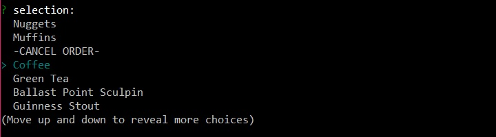
Enter a quantity for purchase,
If quantity is available, purchase will be completed:
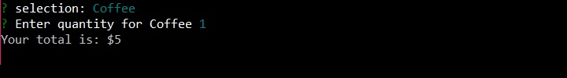
Else, the amount available will be sold:
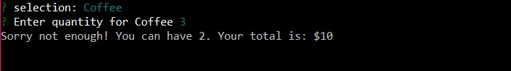


#### Schmamazon Manager ap
At Command Line Interface navigate to project folder and run the command:
 ```shell
 node schmamazonManager.js
 ```
Select from 4 manager functions:
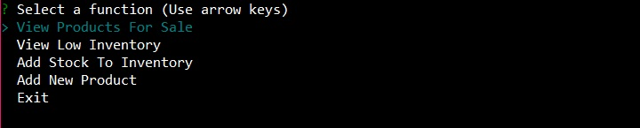
##### View Products:
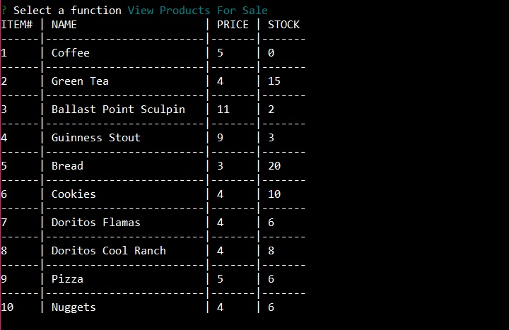
##### View Low Inventory:
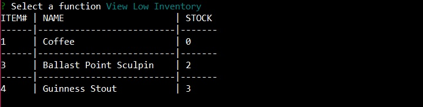
##### Add To Inventory:
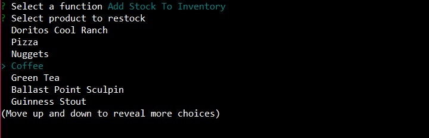
Must enter a number to update
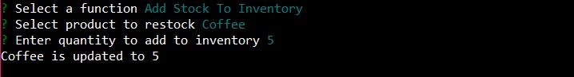
Else, error message
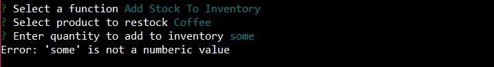
##### Add New Product:
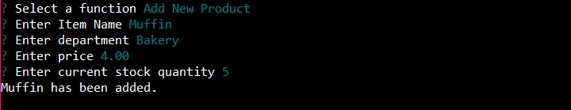
Database requires decimal value for price
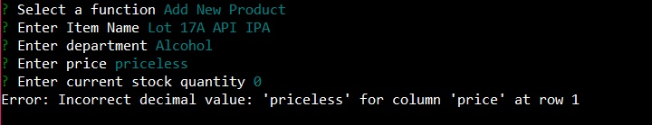
##### View Products (updated):
Databas reflects updates after each command
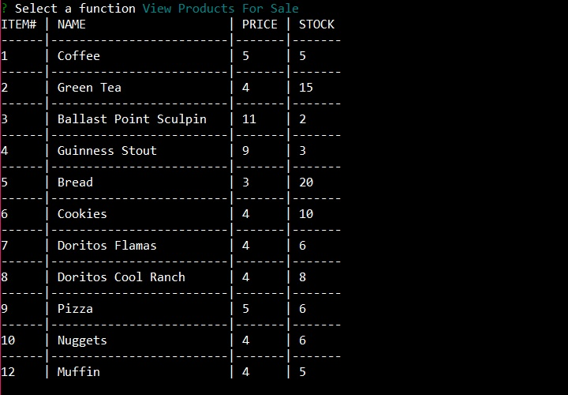
## Installation

If you haven't already, install [Node.js](https://nodejs.org/en/download/)

Clone the repository to your computer. At Command Line Interface, navigate to the project folder and run the following to install the node packages:

 `````````shell
 npm i
 `````````

In MySQL Workbench run the following command:

```sql
CREATE DATABASE schmamazon_db;
```

In config folder, rename `configtemplate.json` to `config.json`
Open the `config.json` file and enter your mysql username and password. Update the database name and port if neccessary.

```js
{
    "development": {
        "username": "YOURUSERNAME",
        "password": "YOURPASSWORD",
        "database": "schmamazon_db",
        "host": "127.0.0.1",
        "port": 3306,
        "dialect": "mysql",
        "logging": false
    },
    "test": {
        "username": "YOURUSERNAME",
        "password": "YOURPASSWORD",
        "database": "schmamazon_db",
        "host": "127.0.0.1",
        "port": 3306,
        "dialect": "mysql",
        "logging": false
    },
    "production": {
        "username": "YOURUSERNAME",
        "password": "YOURPASSWORD",
        "database": "schmamazon_db",
        "host": "127.0.0.1",
        "port": 3306,
        "dialect": "mysql",
        "logging": false
    }
}
```